# SEMANTIC MEDIA SEARCH SYSTEM USING BLIP, CLIP, TF-IDF, AND HYBRID RETRIEVAL

**Student:** [Student Name]  
**Student ID:** [Student ID]  
**Class:** [Class Name]  
**Faculty:** [Faculty Name]  
**University:** [University Name]  
**Instructor:** [Instructor Name]  
**Academic Year:** [Academic Year]

---

# SEMANTIC MEDIA SEARCH SYSTEM USING BLIP, CLIP, TF-IDF, AND HYBRID RETRIEVAL

A final project report submitted in partial fulfillment of the requirements for **[Course / Project Module Name]**.

**Student:** [Student Name]  
**Student ID:** [Student ID]  
**Instructor:** [Instructor Name]  
**Submission Date:** [Submission Date]

---

# INSTRUCTOR'S COMMENT

[This page is reserved for the instructor's comments, evaluation, and signature.]

---

# ACKNOWLEDGEMENT

I would like to express my sincere gratitude to my instructor, **[Instructor Name]**, for providing guidance, feedback, and support throughout the development of this project. The instructor's suggestions helped shape the technical direction of the system and improve the quality of this report.

I would also like to thank the faculty and university for providing the academic environment and learning resources needed to complete this project. Through this work, I had the opportunity to apply knowledge from web development, database design, computer vision, machine learning, and information retrieval in a complete software system.

Finally, I would like to thank my friends, classmates, and family for their encouragement during the research, implementation, testing, and documentation stages of the project.

---

# TABLE OF CONTENTS

> This table of contents should be updated after all headings and page references are finalized.

1. INTRODUCTION  
   1. Reason for choosing this topic  
   2. Implementation plan  
   3. Report structure  
2. Chapter 1. THEORETICAL BASIC  
   1.1 Semantic Media Search and System Architecture  
   1.2 Video Scene Detection and PySceneDetect  
   1.3 BLIP Captioning and CLIP Embeddings  
   1.4 TF-IDF, Hybrid Retrieval, Ranking, and Evaluation  
   1.5 Implementation Technologies: FastAPI, React, Docker, PostgreSQL, and SQLAlchemy  
3. Chapter 2. SYSTEM ANALYSIS AND DESIGN  
   2.1 System Requirements  
   2.2 Use Case Diagram  
   2.3 Activity Diagrams  
   2.4 Sequence Diagrams  
   2.5 State Diagrams  
   2.6 Class Diagram  
4. Chapter 3. IMPLEMENTATION  
   3.1 General Interface  
   3.2 User Interface  
5. CONCLUSION  
   1. Obtained Results / Achievements  
   2. Limitations and Future Development  
6. REFERENCE DOCUMENTS

---

# LIST OF FIGURES

> This list of figures should be updated after diagrams and screenshots are finalized.

- Figure 1-1. Overall architecture of the Semedia semantic media search system
- Figure 1-2. Video processing pipeline from raw video to searchable scenes
- Figure 1-3. BLIP and CLIP roles in media understanding and semantic retrieval
- Figure 1-4. Hybrid retrieval and ranking flow
- Figure 1-5. Main technologies used in Semedia
- Figure 2-1. System-level use case diagram of Semedia
- Figure 2-2. Detailed use case diagram for uploading media
- Figure 2-3. Detailed use case diagram for text search
- Figure 2-4. Detailed use case diagram for image search
- Figure 2-5. Upload media activity diagram
- Figure 2-6. Automatic media processing activity diagram
- Figure 2-7. Text search activity diagram
- Figure 2-8. Image search activity diagram
- Figure 2-9. View and delete media activity diagram
- Figure 2-10. Upload media sequence diagram
- Figure 2-11. Media processing sequence diagram
- Figure 2-12. Text search sequence diagram
- Figure 2-13. Image search sequence diagram
- Figure 2-14. View and delete media sequence diagram
- Figure 2-15. Media item lifecycle state diagram
- Figure 2-16. Video scene processing state diagram
- Figure 2-17. Keyword index lifecycle state diagram
- Figure 2-18. Semedia class diagram
- Figure 3-1. General interface layout of Semedia
- Figure 3-2. Media library interface
- Figure 3-3. Upload media interface
- Figure 3-4. Text search interface
- Figure 3-5. Search result card with score explanation
- Figure 3-6. Grouped video scene results
- Figure 3-7. Image search interface
- Figure 3-8. Media detail interface

---

# LIST OF ABBREVIATIONS

| Abbreviation | Meaning |
|---|---|
| AI | Artificial Intelligence |
| API | Application Programming Interface |
| BLIP | Bootstrapping Language-Image Pre-training |
| CLIP | Contrastive Language-Image Pre-training |
| CNN | Convolutional Neural Network |
| CRUD | Create, Read, Update, Delete |
| DB | Database |
| GPU | Graphics Processing Unit |
| HTTP | HyperText Transfer Protocol |
| IDF | Inverse Document Frequency |
| JSON | JavaScript Object Notation |
| ML | Machine Learning |
| MRR | Mean Reciprocal Rank |
| NDCG | Normalized Discounted Cumulative Gain |
| NLP | Natural Language Processing |
| OCR | Optical Character Recognition |
| ORM | Object-Relational Mapping |
| REST | Representational State Transfer |
| SQL | Structured Query Language |
| TF | Term Frequency |
| TF-IDF | Term Frequency-Inverse Document Frequency |
| UI | User Interface |
| UX | User Experience |

---

# INTRODUCTION

## 1. Reason for choosing this topic

Semantic search for images and videos is an important practical problem because digital media collections are growing rapidly in education, communication, entertainment, research, and business. In many cases, users do not remember the exact file name or folder location of a media file. Instead, they remember the content of the image, the scene in a video, or the general meaning of what they saw. Traditional search methods based only on file names, upload dates, or manually entered metadata are therefore often insufficient.

This challenge is even greater for video data because a single video may contain many different scenes, objects, and events. Searching an entire video as one unit can hide the specific segment that is actually relevant to the user's query. For this reason, a more intelligent system is needed to analyze media content automatically and support retrieval based on meaning.

Semedia was developed to address this problem by combining computer vision, natural language processing, and information retrieval techniques. The system processes uploaded images and videos, generates captions, extracts semantic embeddings, builds a TF-IDF keyword index, and returns ranked results for both text-based and image-based search. The topic is meaningful because it integrates theory and practice into a complete software system with real search, ranking, and evaluation workflows.

## 2. Implementation plan

The implementation schedule follows the original project proposal's implementation plan. The table below presents the planned timeline and major tasks, translated into English while preserving the original timeframes.

| Timeframe | Task |
|---|---|
| 23/02 – 01/03 | Research relevant technologies and models, including CLIP and TF-IDF. |
| 02/03 – 15/03 | Analyze requirements and design the system architecture. |
| 16/03 – 22/03 | Build the backend and basic API; design the database schema. |
| 23/03 – 29/03 | Develop the React frontend. |
| 30/03 – 05/04 | Implement media upload and management features. |
| 06/04 – 12/04 | Build the video frame extraction module. |
| 13/04 – 19/04 | Integrate the CLIP model for embedding generation. |
| 20/04 – 26/04 | Build the vector similarity search system. |
| 27/04 – 03/05 | Integrate BLIP for media caption generation. |
| 04/05 – 08/05 | Implement TF-IDF search and combine search results. |
| 09/05 – 11/05 | Test and optimize the system. |
| 12/05 – 14/05 | Finalize the report and submit the project. |

## 3. Report structure

This report is organized into three main chapters in addition to the introduction, conclusion, and references. The `INTRODUCTION` presents the reason for choosing the topic, the implementation plan, and the structure of the report. `Chapter 1. THEORETICAL BASIC` introduces the core concepts and technologies used in the project, including semantic media search, scene detection, caption generation, embeddings, hybrid retrieval, and implementation technologies. `Chapter 2. SYSTEM ANALYSIS AND DESIGN` presents system requirements, actors, use cases, and design diagrams. `Chapter 3. IMPLEMENTATION` describes the general interface and the main user screens of the Semedia system. Finally, the `CONCLUSION` summarizes the achieved results, limitations, and future development directions, and `REFERENCE DOCUMENTS` lists the technical and project sources used during development.

---

# Chapter 1. THEORETICAL BASIC

## 1.1 Semantic Media Search and System Architecture

Semantic media search is the process of retrieving images and videos according to their visual meaning rather than relying only on file names, folder locations, or manually entered tags. In real applications, users often remember the content of a picture or a moment in a video, but they do not remember the exact metadata associated with that file. For this reason, semantic search systems attempt to represent media in a form that can be compared with natural-language queries or example images. This approach is more flexible than traditional file-based search because it supports retrieval by concept, object, scene, and visual similarity.

In the Semedia project, semantic search is implemented for both images and videos. Images are indexed directly as media items, while videos are divided into smaller scenes so that each scene can become an independent searchable unit. This design is important because users usually want a specific moment in a video instead of the whole file. By converting videos into scene-level records, the system can return more precise and useful results.

The architecture of Semedia follows a service-based design. The `gateway-api` receives upload requests, stores media files, creates database records, and forwards search requests to the dedicated search service. The `media-worker` performs the heavy processing tasks, including scene detection, caption generation, and visual embedding extraction. The `search-api` loads the keyword index, performs vector and lexical retrieval, applies ranking logic, and returns normalized results. The `frontend` presents the user interface for uploading media, searching by text or image, viewing search results, and inspecting media details. In addition, a shared backend package provides common models, pipeline logic, database utilities, storage helpers, and ranking functions used across services.

This architecture separates concerns clearly. Uploading, processing, retrieval, and presentation are handled by different components, which improves maintainability and makes the system easier to test and extend. It also reflects the main idea of semantic media search: raw media is transformed into searchable representations, then those representations are used to answer user queries in a meaningful way.

**Figure 1-1. Overall architecture of the Semedia semantic media search system.**

## 1.2 Video Scene Detection and PySceneDetect

Video scene detection is the process of dividing a video into meaningful temporal segments based on changes in visual content. A long video often contains multiple scenes, each showing different objects, locations, or actions. If the entire video is treated as one search item, important details may be hidden and retrieval precision becomes lower. Scene-level indexing solves this problem by allowing the system to identify and store smaller visual units that better match the user's search intent.

A common approach to scene detection is to compare consecutive frames and identify points where the visual difference becomes significant. Such differences may correspond to a cut, a transition, or a major content change. In Semedia, this task is implemented with PySceneDetect, a Python library designed for automatic scene boundary detection. PySceneDetect provides content-based detection methods that analyze frame-level changes and determine where new scenes begin. This makes it suitable for building a practical video preprocessing pipeline.

Semedia applies scene detection as part of its media processing workflow. When a video is uploaded, the system first reads its duration and then applies an adaptive threshold strategy so that short and long videos are handled appropriately. After detecting scene boundaries, the system extracts a representative keyframe near the middle of each scene. This keyframe acts as the visual summary of that segment and is later used for caption generation, embedding extraction, and thumbnail display. For each detected scene, the system stores the scene index, start time, end time, keyframe path, thumbnail path, caption, and embedding.

PySceneDetect works together with supporting tools such as OpenCV, which is used for reading video frames and saving representative images. Through this process, raw video data is transformed into structured scene records that can participate in the same search pipeline as images. Therefore, scene detection is a key bridge between video storage and fine-grained video retrieval in Semedia.

**Figure 1-2. Video processing pipeline from raw video to searchable scenes.**

## 1.3 BLIP Captioning and CLIP Embeddings

Two core AI techniques in Semedia are automatic caption generation and semantic embedding extraction. These tasks are handled by BLIP and CLIP, which play different but complementary roles in representing visual content.

BLIP, short for Bootstrapping Language-Image Pre-training, is a vision-language model that can generate natural-language descriptions from images. In Semedia, BLIP is used to produce captions for uploaded images and for keyframes extracted from video scenes. These captions help convert visual information into text, which is useful for keyword-based search and for display in the user interface. A generated caption can describe objects, simple actions, and scene context, making the media easier to understand and retrieve through natural-language queries. In practice, the system also applies caption cleanup, normalization, and retry rules for weak captions in order to improve quality and consistency.

CLIP, short for Contrastive Language-Image Pre-training, is a multimodal model that maps images and text into a shared embedding space. In this space, semantically related texts and images are placed closer together. This property allows Semedia to compare a text query with image embeddings, or to compare an example image with stored media embeddings. The similarity between embeddings is measured with cosine similarity, which gives a numerical indication of how closely two items are related in semantic meaning.

The combination of BLIP and CLIP is important because the two models support different retrieval signals. BLIP provides human-readable textual descriptions that strengthen keyword matching and explanation, while CLIP provides dense semantic vectors that support broader meaning-based matching even when exact words are absent. For example, a text query may still retrieve a relevant image if the semantic content is similar, even when the generated caption does not contain the same exact phrase. In the same way, image-based search becomes possible because the query image and stored media can be compared directly in the shared CLIP space.

Supporting tools such as PyTorch and Hugging Face Transformers are used to load and run these models efficiently. As a result, BLIP and CLIP together form the main AI foundation of Semedia's media understanding pipeline.

**Figure 1-3. BLIP and CLIP roles in media understanding and semantic retrieval.**

## 1.4 TF-IDF, Hybrid Retrieval, Ranking, and Evaluation

After captions and embeddings are generated, the next step is retrieval and ranking. Semedia combines classical information retrieval methods with semantic similarity methods in order to improve result quality.

TF-IDF, which stands for Term Frequency-Inverse Document Frequency, is a well-known technique for keyword-based retrieval. Term Frequency measures how often a word appears in a document, while Inverse Document Frequency reduces the weight of terms that are too common across the entire corpus. As a result, TF-IDF gives higher importance to terms that are distinctive in a particular document. In Semedia, the text corpus is formed mainly from captions of images and video scenes. These captions are indexed so that text queries can retrieve relevant media through lexical matching. Instead of rebuilding the keyword index for every query, the system persists keyword index artifacts and reloads them when needed, which improves stability and efficiency.

However, TF-IDF alone is not enough for semantic search. Keyword retrieval is effective when the user's query contains words that also appear in captions, but it may fail when the wording differs or when the user expresses a concept indirectly. For this reason, Semedia also uses vector retrieval based on CLIP embeddings. Vector search captures semantic similarity, while TF-IDF captures lexical evidence. The system combines both through hybrid retrieval, where vector scores and keyword scores are merged into a broader candidate set before final ranking.

Ranking in Semedia is designed to make the final results more reliable and interpretable. The system normalizes scores into the range of `[0, 1]`, applies weighted fusion between semantic and keyword signals, and then performs reranking when stronger evidence is available, such as an exact phrase appearing in a caption. In addition, diversity limits are used to prevent many scenes from the same video from dominating the result page. This is especially important in video search, where one long file may produce many similar scene-level candidates. Explanation fields are also returned so that users can better understand why a result matched.

Evaluation is a necessary part of the retrieval pipeline because search quality should be measured systematically rather than judged only by visual inspection. Semedia uses a locked benchmark corpus and a judged query set to support reproducible experiments. Typical evaluation metrics include Precision@10, which measures how many top results are relevant; Recall@10, which measures how many relevant results are retrieved; MRR, which reflects how early the first relevant result appears; and NDCG@10, which evaluates ranking quality while considering position. With this framework, retrieval improvements can be validated objectively and future regressions can be detected more easily.

**Figure 1-4. Hybrid retrieval and ranking flow.**

## 1.5 Implementation Technologies: FastAPI, React, Docker, PostgreSQL, and SQLAlchemy

Semedia is implemented as a modern web-based software system that combines backend services, a frontend interface, containerized deployment, and persistent data storage. The main implementation technologies were selected to support scalability, maintainability, and practical integration with AI processing components.

FastAPI is used to build the backend services. It is a Python web framework designed for high-performance API development and is well suited for service-based systems. FastAPI supports type-hint-based request validation, clear response modeling, and automatic OpenAPI documentation, which helps make APIs easier to develop, test, and maintain. In Semedia, FastAPI is used to implement upload endpoints, health checks, media management operations, search endpoints, and service-to-service communication.

React is used for the frontend because it follows a component-based and declarative programming model. A React application is built from reusable interface components, and the screen updates automatically when application state changes. This model is appropriate for interactive features such as media upload forms, text search, image search, result cards, and media detail views. In Semedia, React works together with TypeScript and Vite. TypeScript improves code reliability through static typing, while Vite provides fast development and build tooling.

Docker and Docker Compose are used to package and run the full application stack in a reproducible environment. Since Semedia includes multiple services and supporting dependencies, containerization makes development, testing, and deployment more consistent. Through Docker Compose, the gateway API, media worker, search API, frontend, and database can be started and managed together. This is particularly useful for a system that depends on machine learning libraries and multiple backend processes.

PostgreSQL is used as the primary relational database for persistent application data. It stores media records, video-scene records, index metadata, and other structured information needed by the system. SQLAlchemy is used as the ORM layer that maps Python classes to relational tables and supports database operations in a structured, object-oriented way. In Semedia, key models include `MediaItem`, `VideoScene`, and `KeywordIndexArtifact`. Using PostgreSQL together with SQLAlchemy helps maintain a clean separation between application logic and database interaction.

In addition to the main technologies, several supporting tools are important in the implementation. PyTorch and Hugging Face Transformers provide the runtime environment for BLIP and CLIP. PySceneDetect and OpenCV support video segmentation and keyframe extraction. scikit-learn supports TF-IDF vectorization and keyword retrieval, while NumPy assists with vector calculations and similarity operations. For testing and quality assurance, backend services use pytest and the frontend uses Vitest. Together, these technologies form the practical foundation that enables Semedia to operate as a complete semantic media search system.

**Figure 1-5. Main technologies used in Semedia.**

---

# Chapter 2. SYSTEM ANALYSIS AND DESIGN

## 2.1 System Requirements

This section defines the functional scope of Semedia at the system level. The requirements are derived from the implemented architecture of the system, in which a public gateway service receives requests, a media-processing service performs feature extraction, and a search service executes retrieval and ranking over processed image and video content.

### 2.1.1 Actors

Semedia involves two external human actors only.

**1. User**

The User is the primary operational actor of the system. This actor interacts with Semedia through the user interface to upload media files, search the media collection, inspect stored items, and remove items when they are no longer needed. The User is mainly concerned with content ingestion and retrieval.

**2. Admin (System Maintainer/Developer)**

The Admin is the system maintainer and developer responsible for technical operation, validation, and quality control. The Admin can also execute benchmark evaluation workflows to verify retrieval quality, compare results against a baseline, and support system maintenance and further tuning.

### 2.1.2 Functional Requirements

The major functional requirements of Semedia are summarized in Table 2-1.

| ID | Requirement Name | Description | Primary Actor(s) |
|---|---|---|---|
| REQ-1.1 | Upload image and video media | The system shall allow the User to upload both image files and video files through a unified media-ingestion function. The system shall validate the media type, store the original file, create a media record, and place the item into the processing pipeline. | User |
| REQ-1.2 | Store uploaded media records | The system shall store uploaded files and create corresponding media records for later processing, search, viewing, and deletion. | User |
| REQ-1.3 | Display processing status | The system shall display media processing status so the User can understand whether uploaded items are pending, processing, completed, or failed. | User |
| REQ-1.4 | View and delete media | The system shall allow the User to view the stored media library, inspect media details, and delete media items. | User |
| REQ-2.1 | Process uploaded images and videos | After media is uploaded by the User, the system shall automatically process it. For images, it shall generate captions and embeddings. For videos, it shall detect scenes, extract keyframes and thumbnails, generate scene captions, compute embeddings, and update processing status. | User |
| REQ-2.2 | Detect video scenes | After video upload, the system shall detect video scenes and extract representative keyframes for scene-level video retrieval. | User |
| REQ-2.3 | Generate captions | After media upload, the system shall generate captions for images and video scenes. | User |
| REQ-2.4 | Generate embeddings | After media upload, the system shall generate CLIP embeddings for searchable visual content. | User |
| REQ-2.5 | Update keyword index | After media changes, the system shall update the keyword index. | User |
| REQ-3.1 | Search by text and image | The system shall support both text-based queries and image-based queries over the indexed media library. | User |
| REQ-3.2 | Combine retrieval signals | The system shall combine vector retrieval and keyword retrieval for text search. | User |
| REQ-3.3 | Rank and normalize results | The system shall rank and normalize search results before returning them to the frontend. | User |
| REQ-3.4 | Control repetitive scene results | The system shall limit duplicate or overly repetitive video-scene results. | User |
| REQ-3.5 | Return explanations | The system shall return explanation fields for search results. | User |
| REQ-4.1 | Provide upload interface | The frontend shall provide a media upload interface. | User |
| REQ-4.2 | Provide media library interface | The frontend shall provide a media library interface. | User |
| REQ-4.3 | Provide search interfaces | The frontend shall provide text and image search interfaces. | User |
| REQ-4.4 | Display result details | The frontend shall display result score, caption, media type, and explanation. | User |
| REQ-4.5 | Group video scenes | The frontend shall group scenes that belong to the same video. | User |
| REQ-5.1 | Include benchmark corpus | The project shall include a fixed benchmark corpus. | Admin |
| REQ-5.2 | Include judged queries | The project shall include judged evaluation queries. | Admin |
| REQ-5.3 | Report quality metrics | The project shall support reporting search-quality metrics. | Admin |

## 2.2 Use Case Diagram

The use case model describes the external interactions between the actors and Semedia. At the system level, the model is intentionally restricted to two actors only: User and Admin. The User performs operational tasks related to ingestion and retrieval, while the Admin extends those capabilities with benchmarking and maintenance-oriented evaluation activities.

### 2.2.1 System-level Use Case Diagram

At the highest level, Semedia provides major user-facing use cases: Upload Media, Search by Text, Search by Image, View Media, and Delete Media. In addition, the Admin can perform Run Benchmark Evaluation to assess search quality and support system maintenance.

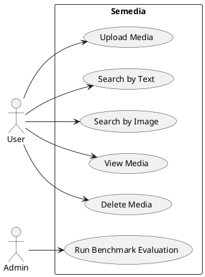

**Figure 2-1. System-level use case diagram of Semedia.**

### 2.2.2 Detailed Use Case: Upload Media

The Upload Media use case enables the User to submit an image or video file into Semedia. After the file is received, the system validates the media type, stores the original file, creates a media record, and starts the processing workflow. When processing finishes successfully, the uploaded media becomes searchable; if processing fails, the system records the failure status for later inspection.

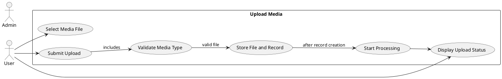

**Figure 2-2. Detailed use case diagram for uploading media.**

### 2.2.3 Detailed Use Case: Search by Text

The Search by Text use case allows the User to retrieve relevant media by entering a natural-language query. The system validates the query, generates a text embedding, combines semantic vector matching with keyword-based retrieval, and ranks image or video-scene candidates. The result set includes normalized scores and explanations so the User can understand why each result was retrieved.

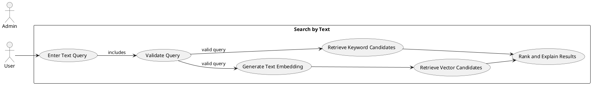

**Figure 2-3. Detailed use case diagram for text search.**

### 2.2.4 Detailed Use Case: Search by Image

The Search by Image use case allows the User to submit an example image as a query instead of textual input. The system validates the query image, computes its embedding, and compares that embedding against stored image and video-scene embeddings. This enables content-based retrieval even when the User does not know the exact words needed to describe the target content.

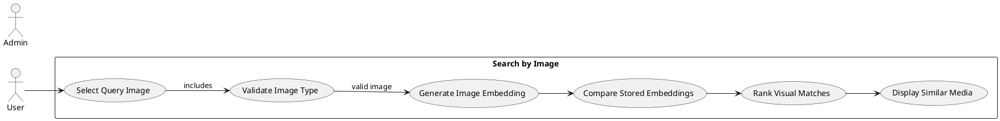

**Figure 2-4. Detailed use case diagram for image search.**

### 2.2.5 Detailed Use Case Specifications

#### Use Case 1: Upload Media

| Field | Content |
|---|---|
| Use Case Name | Upload Media |
| Actor | User |
| Description | The User uploads an image or video to the system. |
| Preconditions | The User has access to the application and the selected file is supported. |
| Postconditions | A media record is created and processing is started. |
| Main Flow | 1. User opens upload interface. 2. User selects file. 3. Frontend sends file to gateway API. 4. Gateway stores file. 5. Gateway creates media record. 6. The system starts processing. 7. The UI displays upload status. |
| Alternative Flow | If the file type is unsupported, the system rejects the upload and shows an error message. If processing fails, the system marks the item as failed. |

#### Use Case 2: Search by Text

| Field | Content |
|---|---|
| Use Case Name | Search by Text |
| Actor | User |
| Description | The User searches media using a natural-language text query. |
| Preconditions | The system contains processed media and the query text is not empty. |
| Postconditions | Ranked search results are displayed. |
| Main Flow | 1. User enters query. 2. Frontend sends query to gateway API. 3. Gateway forwards the request to the search API. 4. The system creates a text embedding and retrieves vector and keyword candidates. 5. The system fuses scores and reranks results. 6. The frontend displays ranked results. |
| Alternative Flow | If the query is empty, the system rejects the request. If no matching result exists, the frontend displays an empty result state. |

#### Use Case 3: Search by Image

| Field | Content |
|---|---|
| Use Case Name | Search by Image |
| Actor | User |
| Description | The User searches media using an example image. |
| Preconditions | The User provides a valid image query and the media library contains processed items. |
| Postconditions | Visually similar or semantically related results are displayed. |
| Main Flow | 1. User selects query image. 2. Frontend uploads the query image. 3. The system generates a CLIP image embedding. 4. The system compares it with stored embeddings. 5. The system ranks the candidates. 6. The frontend displays result cards. |
| Alternative Flow | If the image cannot be processed, the system displays an error message. |

#### Use Case 4: View and Delete Media

| Field | Content |
|---|---|
| Use Case Name | View and Delete Media |
| Actor | User |
| Description | The User views media details or deletes a media item. |
| Preconditions | The media item exists in the system. |
| Postconditions | Details are displayed or the item is removed from the system. |
| Main Flow | 1. User opens a media item. 2. The system displays metadata, caption, scenes, and thumbnails. 3. User may choose delete. 4. The system removes database records and stored files. 5. Search data is refreshed. |
| Alternative Flow | If deletion fails, the system keeps the media item and displays an error message. |

#### Use Case 5: Run Benchmark Evaluation

| Field | Content |
|---|---|
| Use Case Name | Run Benchmark Evaluation |
| Actor | Admin |
| Description | The admin runs the benchmark workflow to evaluate search quality. |
| Preconditions | The benchmark corpus and judged queries are available. |
| Postconditions | A search-quality report is generated for review. |
| Main Flow | 1. Admin starts the evaluation workflow. 2. The system runs benchmark queries against the current stack. 3. The system calculates evaluation metrics. 4. The system outputs a report for review. |
| Alternative Flow | If evaluation data is missing or the run fails, the system reports the error and no final report is produced. |

## 2.3 Activity Diagrams

This section presents the main operational workflows of Semedia. Activity diagrams should be created in PlantUML or StarUML so they follow standard UML notation and are easy to export into the final report.

### 2.3.1 Upload Media Activity Diagram

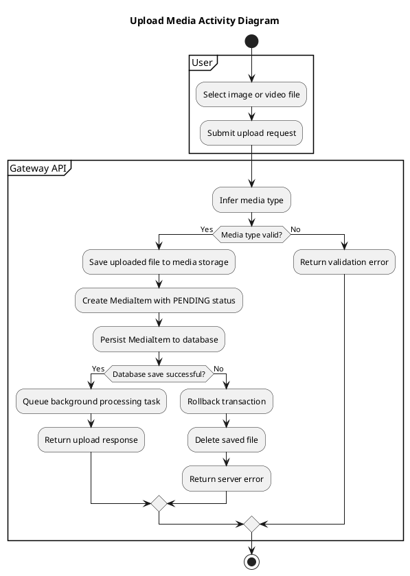

**Figure 2-5. Upload media activity diagram.**

### 2.3.2 Automatic Media Processing Activity Diagram

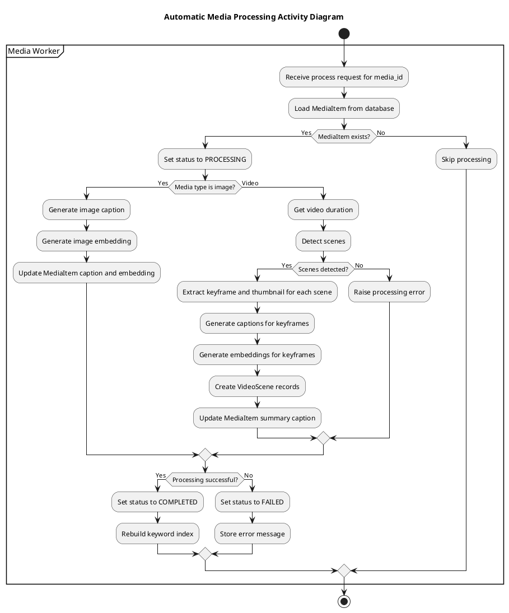

**Figure 2-6. Automatic media processing activity diagram.**

### 2.3.3 Search by Text Activity Diagram

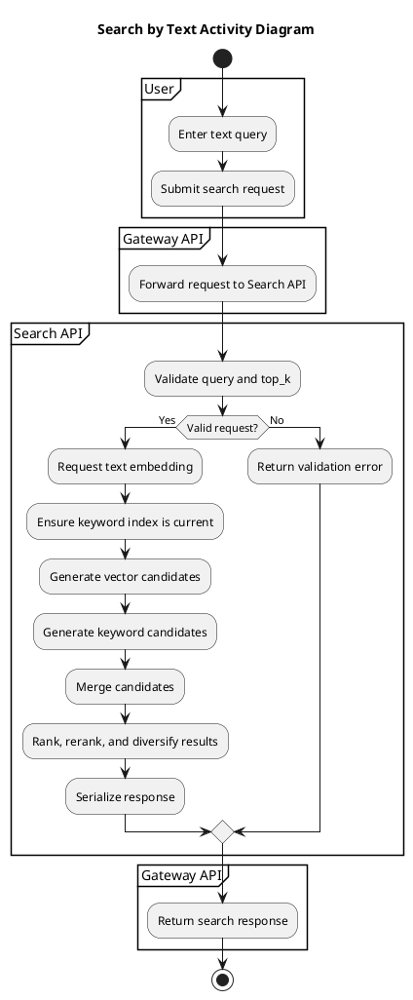

**Figure 2-7. Text search activity diagram.**

### 2.3.4 Search by Image Activity Diagram

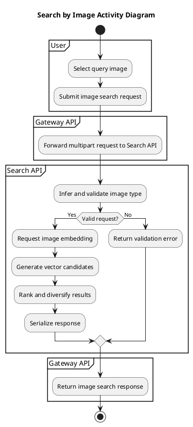

**Figure 2-8. Image search activity diagram.**

### 2.3.5 View and Delete Media Activity Diagram

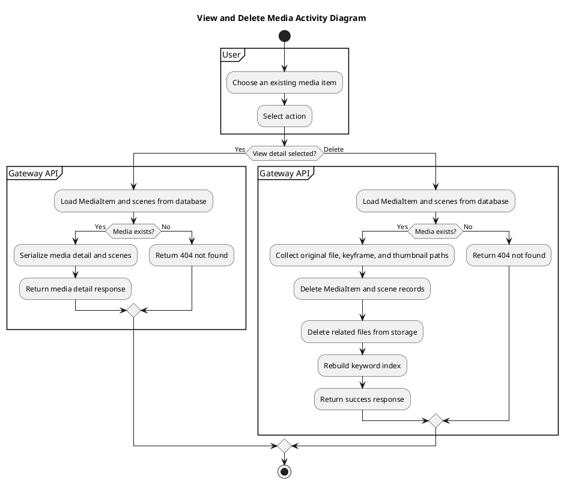

**Figure 2-9. View and delete media activity diagram.**

## 2.4 Sequence Diagrams

Sequence diagrams should be drafted in Mermaid for faster iteration and easier text-based maintenance during report preparation.

### 2.4.1 Upload Media Sequence Diagram

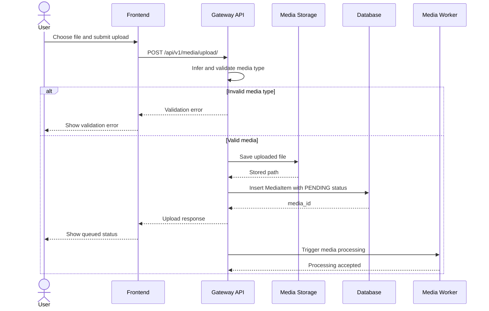

**Figure 2-10. Upload media sequence diagram.**

### 2.4.2 Media Processing Sequence Diagram

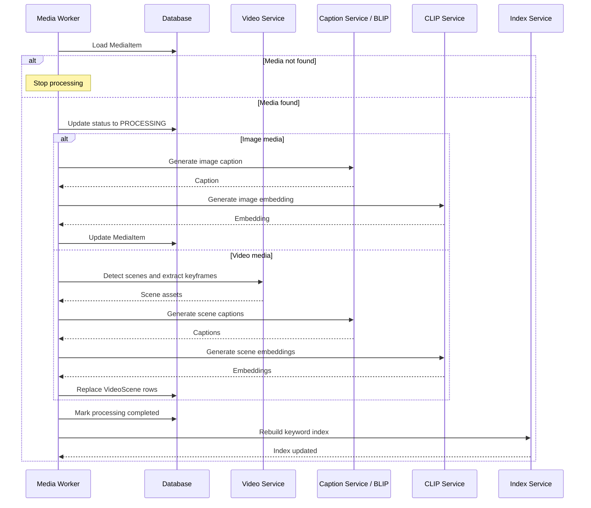

**Figure 2-11. Media processing sequence diagram.**

### 2.4.3 Search by Text Sequence Diagram

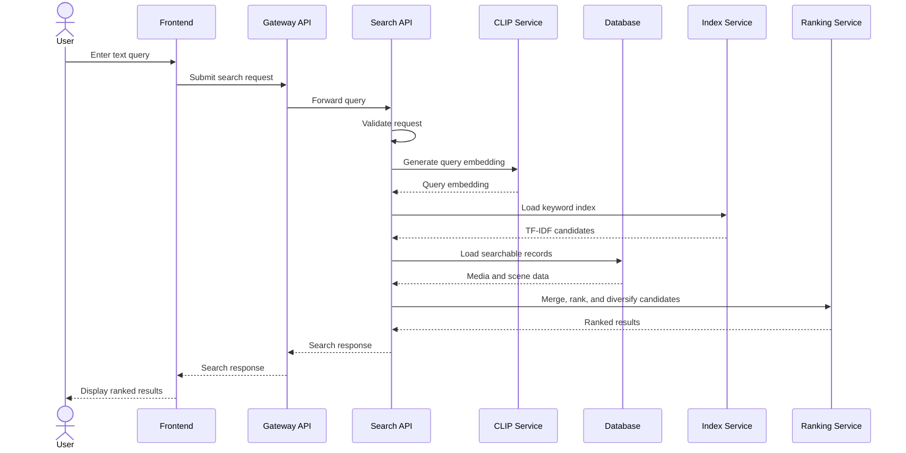

**Figure 2-12. Text search sequence diagram.**

### 2.4.4 Search by Image Sequence Diagram

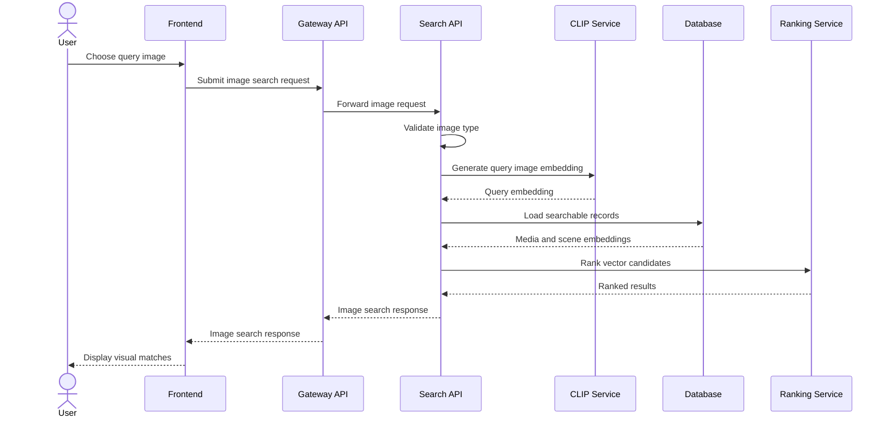

**Figure 2-13. Image search sequence diagram.**

### 2.4.5 View and Delete Media Sequence Diagram

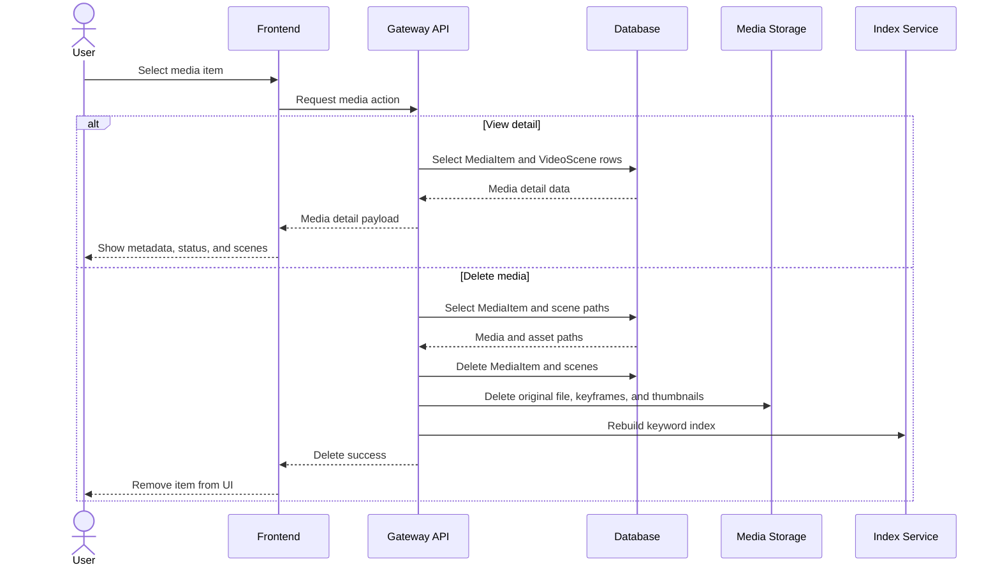

**Figure 2-14. View and delete media sequence diagram.**

## 2.5 State Diagrams

State diagrams should be created in PlantUML or StarUML so they remain consistent with standard UML state modeling.

### 2.5.1 MediaItem Lifecycle State Diagram

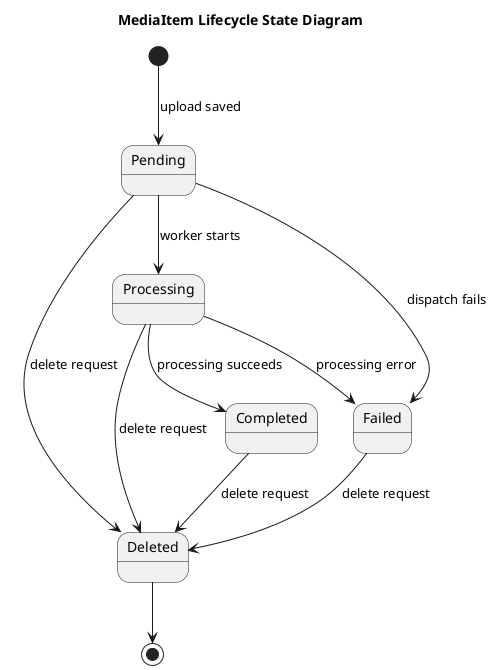

**Figure 2-15. Media item lifecycle state diagram.**

### 2.5.2 VideoScene Processing State Diagram

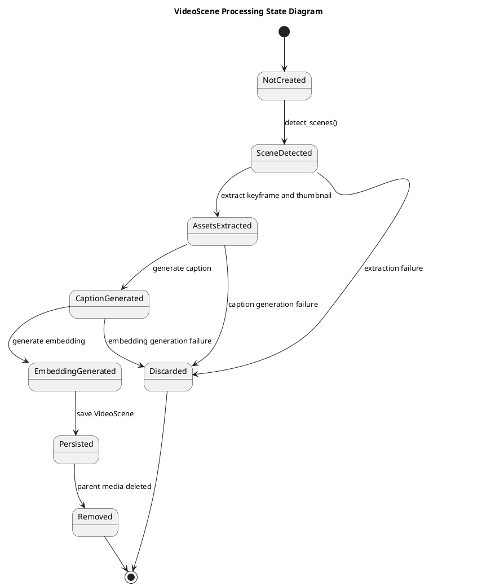

**Figure 2-16. Video scene processing state diagram.**

### 2.5.3 Keyword Index Artifact Lifecycle State Diagram

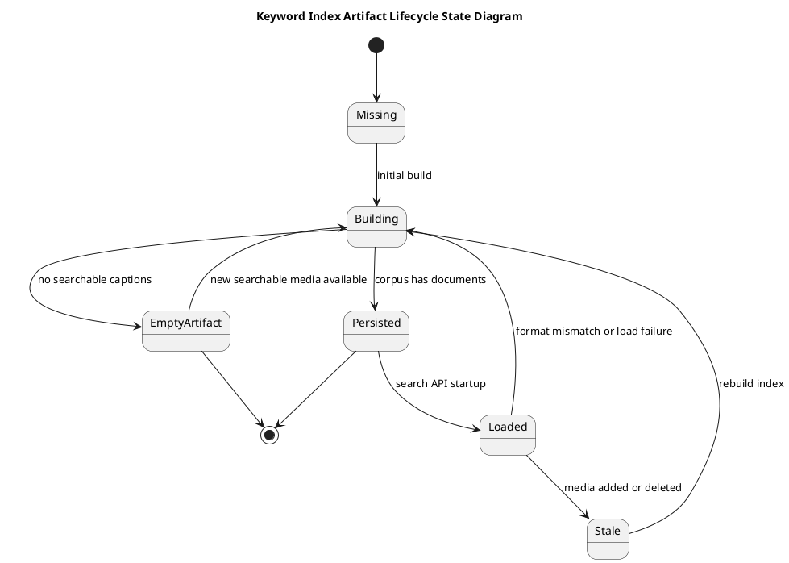

**Figure 2-17. Keyword index lifecycle state diagram.**

## 2.6 Class Diagram

This class diagram focuses on the three central persistence models of Semedia. `MediaItem` is the parent entity for uploaded files, `VideoScene` stores scene-level search data for videos, and `KeywordIndexArtifact` stores the serialized keyword-search index derived from completed media content.

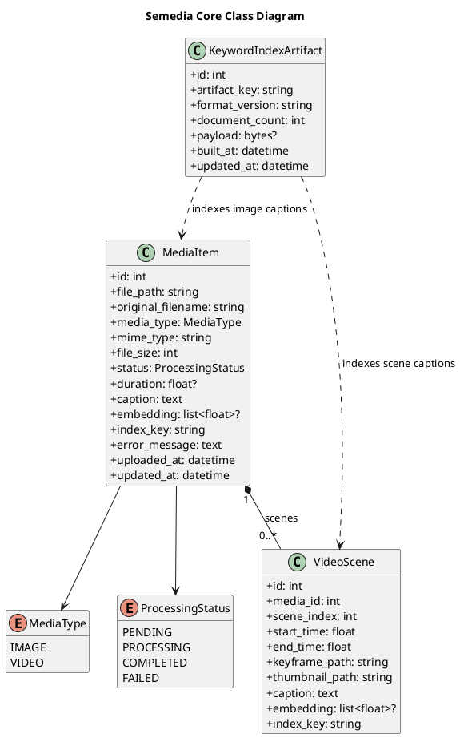

**Figure 2-18. Semedia class diagram.**

---

# Chapter 3. IMPLEMENTATION

## 3.1 General Interface

Semedia was implemented as a web-based semantic media search system for image and video retrieval. The system integrates a React frontend with FastAPI-based backend services to provide a complete workflow from media upload to automatic processing and search result presentation. From the user's perspective, the application exposes a unified interface for managing a media library, submitting text or image queries, reviewing ranked results, and inspecting detailed information for each media item.

The interface is organized into four main functional areas: the media dashboard and library view, the upload interface, the search workspace, and the media detail view. This structure keeps media management, retrieval, and result inspection easy to distinguish while still supporting the full semantic search workflow.

From an implementation standpoint, the frontend communicates with the backend through HTTP APIs. When a user uploads a media file, the gateway service stores the file and creates a media record. The media worker then automatically performs image or video processing tasks. For video content, the worker applies scene detection to segment the video into meaningful scenes. For visual understanding, the system generates textual captions using the BLIP model and produces multimodal embeddings using the CLIP model. Search requests are then handled through a hybrid retrieval pipeline that combines TF-IDF keyword matching and vector similarity scoring. The ranking layer further applies score normalization, explanation generation, and diversity constraints so that results are both interpretable and less repetitive.

**Figure 3-1. General interface layout of Semedia.**

## 3.2 User Interface

The user interface of Semedia was developed with React and TypeScript to provide a responsive and interactive user experience. Users can upload or manage media, perform searches, review ranked results, and inspect details of relevant items through a consistent set of screens.

The dashboard and media library serve as the entry point of the application. This screen presents the current media collection and allows users to observe uploaded items together with their processing state and basic metadata. By organizing content in a visual list or grid, the interface makes it easier to verify whether files have been ingested successfully and whether they are available for retrieval operations.

[Insert Figure 3-2 here: Media library interface]

**Figure 3-2. Media library interface showing uploaded media items and system status.**

The upload interface enables users to add image and video files to the system. The design emphasizes ease of use by exposing a clear upload action and by reflecting processing progress after submission. Once a file is accepted, the backend starts the corresponding workflow automatically. For images, the system extracts caption and embedding information. For videos, the system performs scene segmentation, generates representative frames, and computes scene-level semantic representations.

[Insert Figure 3-3 here: Upload media interface]

**Figure 3-3. Upload interface used to submit image and video files for automatic processing.**

For text-based retrieval, the interface provides a search bar where users can enter natural-language queries. This feature allows users to search media collections semantically rather than relying only on file names or manually assigned tags. After submission, the frontend sends the query to the backend search service, which combines TF-IDF keyword retrieval and CLIP-based vector retrieval. The resulting list is sorted through hybrid ranking logic so that visually and semantically relevant items are prioritized.

[Insert Figure 3-4 here: Text search interface]

**Figure 3-4. Text search interface for natural-language semantic retrieval.**

Each retrieved result is presented through a result card. The result card summarizes the most important search information in a compact format. Typical elements include thumbnail preview, title or file identifier, media type, score-related information, and textual explanations that help the user understand why the item was returned. This explanation-oriented design is important because semantic search performs ranking and inference, which are more transparent when accompanied by normalized scores and explanation fields.

[Insert Figure 3-5 here: Search result card]

**Figure 3-5. Result card displaying preview content, metadata, normalized score, and relevance explanation.**

A notable user-interface feature of Semedia is grouped video-scene retrieval. Rather than treating each video as a single undifferentiated object, the system allows individual scenes to be retrieved and displayed while still preserving their relationship to the original video. In the interface, grouped scene results help users identify which segment of a video is relevant to the query. This design is especially useful for long videos, where only a short scene may correspond to the search intent.

[Insert Figure 3-6 here: Grouped video scenes]

**Figure 3-6. Grouped video-scene results showing scene-level matches within a parent video.**

In addition to text search, the interface supports image-based search. In this workflow, users can submit or select an image query and retrieve visually similar media items from the library. This capability demonstrates the multimodal nature of the system, since CLIP embeddings are used not only for text-to-image matching but also for image-to-image similarity. The interface for image search was designed to be consistent with text search so that users can switch between retrieval modes without learning a different interaction model.

[Insert Figure 3-7 here: Image search interface]

**Figure 3-7. Image search interface for retrieving visually similar media items.**

The media detail page provides a more comprehensive view of a selected item. On this screen, users can inspect file metadata, captions generated by the BLIP model, processing status, preview images, and, in the case of videos, scene-specific information. This detailed view is important for validating search outcomes because it gives users access to the underlying descriptive and structural information used by the retrieval pipeline.

[Insert Figure 3-8 here: Media detail interface]

**Figure 3-8. Media detail interface showing metadata, generated captions, and scene-related information.**

In summary, the user interface of Semedia supports the complete lifecycle of semantic media retrieval. It enables media upload and management, automatic processing feedback, natural-language and image-based search, scene-level exploration of videos, and detailed result inspection.

---

# CONCLUSION

## 1. Obtained Results / Achievements

The Semedia project successfully implemented a semantic media search system for images and videos with an end-to-end workflow from ingestion to retrieval. First, the system supports media upload and media management through a web-based interface, allowing users to maintain a searchable media collection. Second, it performs automatic processing for both images and videos, reducing the need for manual annotation.

For video content, the system applies scene detection so that long videos can be decomposed into searchable segments. This improves retrieval granularity and enables users to discover specific relevant moments rather than only the entire video file. For semantic understanding, the project integrates BLIP-based caption generation and CLIP-based embedding extraction, thereby combining textual and visual representations in a unified search pipeline.

Another major achievement is the implementation of TF-IDF keyword retrieval together with vector-based semantic retrieval. Instead of depending on only one search paradigm, the system uses hybrid ranking to combine the strengths of lexical matching and embedding similarity. In addition, the project implements score normalization, explanation fields, and diversity control, which improve the interpretability and practical usefulness of search results.

From the software engineering perspective, the project also achieved a complete frontend implementation using React, providing an accessible user interface for media library management, upload, text search, image search, scene browsing, and result inspection. Finally, an important non-visual achievement is the benchmark and evaluation infrastructure. By establishing a judged query set, baseline reports, and evaluation workflows, the project created a foundation for measuring retrieval quality systematically and for supporting future search improvements on empirical evidence rather than intuition alone.

Overall, the obtained results demonstrate that Semedia is not merely a prototype for storing media files, but a functional semantic retrieval system that integrates modern computer vision, natural language processing, hybrid information retrieval, and practical web application development.

## 2. Limitations and Future Development

Although the project achieved its primary objectives, several limitations remain. First, the current vector retrieval approach is based on local similarity computation, which is suitable for small or moderate collections but may face scalability challenges as the database size grows. For future development, integrating a dedicated vector database or approximate nearest neighbor search technique would improve efficiency and scalability.

Second, the keyword retrieval component relies on a TF-IDF index that must be rebuilt when the searchable library changes significantly. While this method is effective and transparent, the rebuild cost may become more noticeable for larger datasets. Future work should consider more incremental indexing strategies or more advanced hybrid search infrastructures.

Third, retrieval quality depends heavily on the quality of generated captions and pretrained models. BLIP and CLIP provide strong baseline performance, but they are not perfect for all domains. Caption errors, domain mismatch, and limited action understanding can negatively affect search accuracy. This limitation is particularly visible in complex video actions, where subtle events or temporal relationships may not be fully captured. Therefore, future development should explore stronger captioning models, better temporal understanding, and richer multimodal representations.

Another limitation concerns semantic coverage. The current system does not yet incorporate OCR, detailed object recognition, or explicit action recognition as first-class retrieval signals. Adding these capabilities would improve performance for queries involving text inside images, specific objects, or fine-grained events in videos. Similarly, query expansion techniques could help the system handle broader vocabulary variation and ambiguous user intent.

The benchmark and evaluation infrastructure is an important contribution, but its scope is still limited by the size and diversity of the current judged dataset. Expanding the benchmark corpus, increasing the variety of media categories, and improving relevance annotations would make evaluation more robust. In addition, logging user feedback and real search interactions could support continuous refinement of ranking strategies over time.

Finally, several user-experience improvements are still possible. These include clearer filtering and sorting options, richer result comparison tools, more informative progress indicators, and improved responsiveness for large-scale collections. Such enhancements would not change the core retrieval pipeline, but they would increase usability and readiness for practical deployment.

In conclusion, Semedia provides a strong foundation for semantic media search, but future development should focus on scalability, richer multimodal understanding, expanded evaluation, feedback-driven optimization, and user-interface refinement.

---

# REFERENCE DOCUMENTS

1. OpenAI. "CLIP: Connecting Text and Images." Available at: https://github.com/openai/CLIP
2. Radford, A., Kim, J. W., Hallacy, C., et al. "Learning Transferable Visual Models From Natural Language Supervision." Proceedings of the 38th International Conference on Machine Learning, 2021. Available at: https://arxiv.org/abs/2103.00020
3. Li, J., Li, D., Xiong, C., and Hoi, S. "BLIP: Bootstrapping Language-Image Pre-training for Unified Vision-Language Understanding and Generation." Proceedings of the 39th International Conference on Machine Learning, 2022. Available at: https://arxiv.org/abs/2201.12086
4. Hugging Face. "Transformers Documentation." Available at: https://huggingface.co/docs/transformers/
5. PySceneDetect. "Official Documentation." Available at: https://www.scenedetect.com/docs/latest/
6. FastAPI. "FastAPI Documentation." Available at: https://fastapi.tiangolo.com/
7. React. "React Documentation." Available at: https://react.dev/
8. Vite. "Vite Documentation." Available at: https://vite.dev/
9. Docker. "Docker Documentation." Available at: https://docs.docker.com/
10. PostgreSQL. "PostgreSQL Documentation." Available at: https://www.postgresql.org/docs/
11. SQLAlchemy. "SQLAlchemy Documentation." Available at: https://docs.sqlalchemy.org/
12. scikit-learn. "Feature Extraction: Text Data and TF-IDF." Available at: https://scikit-learn.org/stable/modules/feature_extraction.html
13. Manning, C. D., Raghavan, P., and Schütze, H. Introduction to Information Retrieval. Cambridge University Press, 2008. Available at: https://nlp.stanford.edu/IR-book/
14. Semedia Project Documentation. `docs/plan.md` — search quality improvement roadmap.
15. Semedia Project Documentation. `docs/TASKS.md` — implementation task tracking and progress summary.
16. Semedia Project Documentation. `docs/metrics/search_quality_history.md` — baseline and tuning history.
17. Semedia Project Documentation. `docs/metrics/search_tuning_checklist.md` — search parameter tuning workflow.
18. Semedia Project Documentation. `docs/metrics/evaluation_benchmark_rubric.md` — evaluation rubric and relevance judgment guidance.
19. Semedia Project Documentation. `docs/implementations/phase2-processing-indexing.md` — processing and indexing implementation notes.
20. Semedia Project Documentation. `docs/implementations/phase4-caption-quality.md` — caption quality implementation notes.
21. Semedia Project Documentation. `docs/implementations/phase6-ranking-explanations.md` — ranking and explanation implementation notes.
